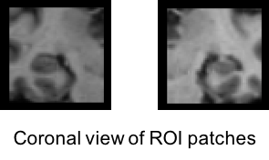

# `train roi` - Train deep learning networks using predefined Regions of Interest (ROI)

This option allows training a network on two Regions of Interest (ROI).
ROI inputs correspond to two patches of size 50x50x50 manually centered on each hippocampus.
This manual centering has only been done for `t1-linear` preprocessing.

Two network types can be trained with the `roi` input type:

- `autoencoder`, that trains one autoencoder on the two hippocampi,
- `cnn`, that trains one CNN on the two hippocampi,

It is possible to transfer trainable parameters between models. In the following list the weights are transferred 
from `source task` to `target task`:

- `autoencoder` to `cnn`: the trainable parameters of the convolutional part of the `cnn` 
(convolutions and batch normalization layers) take the values of the trainable parameters of the encoder part of the source autoencoder,
- `cnn` to `cnn`: all the trainable parameters are transferred between the two models.

!!! info "Common options"
    Options that are common to all pipelines can be found in the introduction of [`clinicadl train`](./Introduction.md#running-the-pipeline)

## `train roi autoencoder` - Train autoencoders using ROI

The objective of an autoencoder is to learn to reconstruct images given in input while performing a dimension reduction. 

The difference between the input and the output image is given by the mean squared error.
In clinicadl, autoencoders are designed [based on a CNN architecture](./Introduction.md#autoencoders-construction-from-cnn-architectures). 

There is one specific option for this pipeline: 

- `--visualization` (bool) if this flag is given, inputs of the train and
the validation sets and their corresponding reconstructions are written in `autoencoder_reconstruction`.
Inputs are reconstructed based on the model that obtained the best validation loss.

??? note "Model selection"
    The selection of a best model is only performed at the end of an epoch 
    (a model cannot be selected based on internal evaluations in an epoch).

The complete output file system is the following (the folder `autoencoder_reconstruction` is created only if the 
flag `--visualization` was given):

<pre>
results
├── commandline.json
├── environment.txt
└── fold-0
    ├── autoencoder_reconstruction
    │   ├── train
    │   │   ├── input-0.nii.gz
    │   │   ├── ...
    │   │   ├── input-5.nii.gz
    │   │   ├── output-0.nii.gz
    │   │   ├── ...
    │   │   └── output-5.nii.gz
    │   └── validation
    │        ├── input-0.nii.gz
    │        ├── ...
    │        ├── input-5.nii.gz
    │        ├── output-0.nii.gz
    │        ├── ...
    │        └── output-5.nii.gz
    ├── models
    │    └── best_loss
    │        └── model_best.pth.tar
    └── tensorboard_logs
         ├── train
         │    └── events.out.tfevents.XXXX
         └── validation
              └── events.out.tfevents.XXXX
</pre>

`autoencoder_reconstruction` contains the reconstructions of the two regions of the three first participants of the dataset.

## `train roi cnn` - Train classification CNN using ROI

The objective of this unique CNN is to learn to predict labels associated to images.
The set of images used corresponds to the two hippocampi in MR volumes.

The output of the CNN is a vector of size equals to the number of classes in this dataset.
This vector can be preprocessed by the [softmax function](https://pytorch.org/docs/master/generated/torch.nn.Softmax.html) 
to produce a probability for each class. During training, the CNN is optimized according to the cross-entropy loss, 
which becomes null for a subset of images if the CNN outputs 100% probability for the true class of each image of the subset.

The options specific to this pipeline are the following:

- `--transfer_learning_path` (str) is the path to a results folder (output of `clinicadl train`). 
The best model of this folder will be used to initialize the network as explained in the [introduction](./Image.md). 
If nothing is given the initialization will be random.
- `--transfer_learning_selection` (str) corresponds to the metric according to which the best model of `transfer_learning_path` will be loaded. 
This argument will only be taken into account if the source network is a CNN. 
Choices are `best_loss` and `bset_balanced_accuracy`.  Default: `best_balanced_accuracy`.
- `--selection_threshold` (float) threshold on the balanced accuracies to compute the image-level performance. 
regions are selected if their balanced accuracy > threshold. Default corresponds to no selection.

??? note "Model selection"
    The selection of a best model is only performed at the end of an epoch 
    (a model cannot be selected based on internal evaluations in an epoch).

!!! warning
    Contrary to `patch` and `slice`, `roi` inputs cannot be extracted with `clinicadl extract`.

The complete output file system is the following:

<pre>
results
├── commandline.json
├── environment.txt
└── fold-0
    ├── cnn_classification
    │   ├── best_balanced_accuracy
    │   │   ├── train_image_level_metrics.tsv
    │   │   ├── train_image_level_prediction.tsv
    │   │   ├── train_roi_level_metrics.tsv
    │   │   ├── train_roi_level_prediction.tsv
    │   │   ├── validation_image_level_metrics.tsv
    │   │   ├── validation_image_level_prediction.tsv
    │   │   ├── validation_roi_level_metrics.tsv
    │   │   └── validation_roi_level_prediction.tsv
    │   └── best_loss
    │       └── ...
    ├── models
    │   ├── best_balanced_accuracy
    │   │   └── model_best.pth.tar
    │   └── best_loss
    │       └── model_best.pth.tar
    └── tensorboard_logs
         ├── train
         │    └── events.out.tfevents.XXXX
         └── validation
              └── events.out.tfevents.XXXX
</pre>

!!! note "Level of performance"
    The performances are obtained at two different levels: region-based and image-level.
    Region-based performance corresponds to an evaluation in which both ROI are considered to be independent.
    However it is not the case, and what is more interesting is the evaluation on the image-level, 
    for which the predictions of the two regions were assembled.
